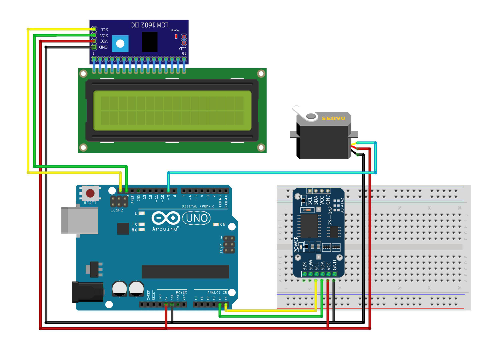

# Automatic Cow Feeder

This project demonstrates an automatic cow feeding system using an Arduino. The system uses an RTC (DS3231) to schedule feeding times, controlling a servo motor to dispense food at set intervals. An LCD display shows the current date and time.

## Components Used

- **Arduino IDE** or Text Editor (e.g., Visual Studio Code)
- **Library: LiquidCrystal_I2C**
- **Library: RTC**
- **Library: Servo**
- **Arduino Uno** (or compatible board) - 1 Unit
- **DS3231 RTC Module** - 1 Unit
- **Servo Motor** - 1 Unit
- **LiquidCrystal_I2C (LCD)** (16x2) - 1 Unit
- **I2C Module** - 1 Unit
- **Project Board / BreadBoard** - 1 Unit
- **Jumper Wires**
- **Power Supply** (for Arduino and other components)

# Schematic:

- Below you can see a schematic image to facilitate the wiring of cables from the microcontroller to devices, both input and output sensors:



## Circuit Diagram

### Wiring Instructions

- **DS3231 RTC Module:**

  - **SDA** to SDA pin on Arduino (A4)
  - **SCL** to SCL pin on Arduino (A5)
  - **VCC** to 5V
  - **GND** to GND

- **Servo Motor:**

  - **Control Pin** to Digital Pin 9 (D9) on the Arduino
  - **VCC** to 5V
  - **GND** to GND

- **LiquidCrystal_I2C (16x2) + I2C Module:**
  - **SDA I2C** to pin A4 on Arduino
  - **SCL I2C** to pin A5 on Arduino
  - **VCC I2C** to 5V
  - **GND I2C** to GND

## Work Steps

1. Gather all the components listed above.
2. Connect the components following the wiring instructions.
3. Open the Arduino IDE and connect your Arduino board.
4. Copy the provided code into the Arduino IDE.
5. Upload the code to your Arduino Uno.
6. Set the initial date and time in the code (only needed during the first upload).
7. Once the system is running, the cow feeder will operate automatically based on the set time.

## How It Works

- The system continuously checks the current time using the DS3231 RTC module.
- When the set time (hour and minute) matches the current time, the servo motor rotates to dispense food.
- The servo motor remains open for a few seconds and then returns to its original position, stopping the food dispense.
- The current date and time are displayed on the LCD screen.

## Code Explanation

- **RTC Initialization:** The DS3231 RTC module is initialized to keep track of the current time.
- **LCD Display:** The LiquidCrystal_I2C library is used to interface with a 16x2 LCD display, showing the date and time.
- **Servo Control:** The servo motor is controlled on pin D9, opening to dispense food when the set time is reached.

```cpp
#include <LiquidCrystal_I2C.h>      // Library for LCD I2C
LiquidCrystal_I2C lcd(0x27, 16, 2); // LCD I2C address

#include <DS3231.h>       // Library for DS3231 RTC
DS3231 rtc(SDA, SCL);     // Initialize I2C communication
Time t;                   // Variable to store time
int set_jam = 15;         // Set alarm hour
int set_menit = 00;       // Set alarm minute

#include <Servo.h>  // Library for Servo Motor
Servo myservo;      // Declare servo motor

void setup() {
  lcd.init();               // Initialize LCD
  lcd.setBacklight(HIGH);
  myservo.attach(9);        // Attach servo motor to pin D9
  myservo.write(0);         // Set initial servo position
  rtc.begin();              // Start RTC
  // Setting initial date and time
  rtc.setDate(30, 9, 2020);  // Set date
  rtc.setTime(14, 59, 50);   // Set time
  rtc.setDOW(3);             // Set day of the week (Wednesday)
}

void loop() {
  lcd.setCursor(0, 0);
  lcd.print(rtc.getDateStr()); // Display date

  lcd.setCursor(0, 1);
  lcd.print(rtc.getTimeStr()); // Display time

  t = rtc.getTime();            // Read current time
  int jam = t.hour;
  int menit = t.min;
  int detik = t.sec;

  if(set_jam == jam) {          // If current hour matches alarm hour
    if(set_menit == menit) {    // If current minute matches alarm minute
      if(detik < 5) {           // If current second is within first 5 seconds
        myservo.write(90);      // Open servo motor
      } else {
        myservo.write(0);       // Close servo motor
      }
    }
  }

  delay(1000); // Delay 1 second per cycle
}
```

## Usage

- Set the feeding time by adjusting the hour (set_jam) and minute (set_menit) variables in the code.
- The system will automatically dispense food at the scheduled time.
- Monitor the system's operation via the LCD display, which shows the current date and time.

## Conclusion

- The Automatic Cow Feeder project automates the process of feeding livestock by scheduling feeding times using an Arduino and RTC module. This project is a practical solution for managing feeding times efficiently, reducing manual labor and ensuring timely feeding.

- When the tool is activated, it will start counting time
  and provide food according to the specified time
  determined automatically

#### @Copyright 2024 | Automatic-Cow-Feeder
